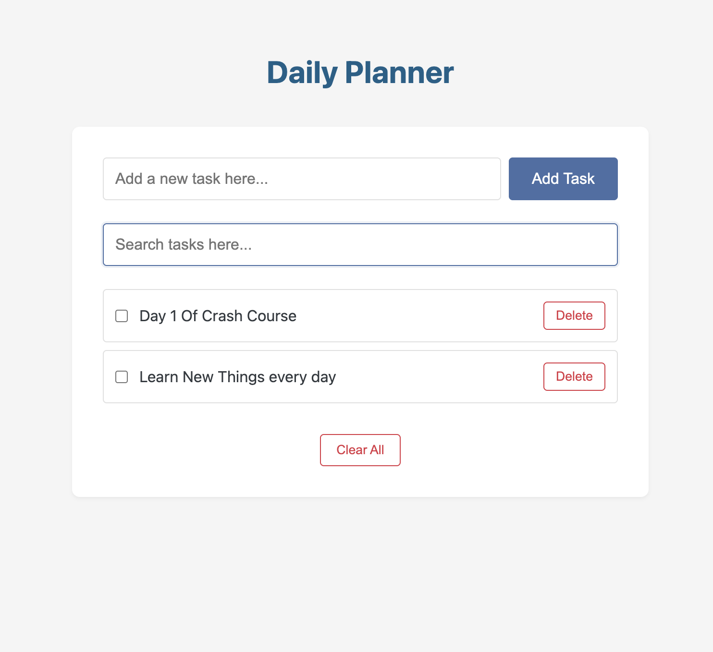

# 📝 Daily Planner - Mini Project 1 ( BY ALIPA )

A simple web app to help you plan your daily tasks. You can add, complete, delete, and search your tasks. All tasks are saved in your browser using localStorage.

---

## 📌 About the Project

This project is a basic daily planner that focuses on:
- Adding tasks
- Marking tasks as complete
- Deleting tasks
- Searching tasks with debounce (to avoid lag)
- Saving tasks even after page refresh using localStorage

---

## 🖼️ Image
Output Image :



---

## ❓ Problem Statement

People often forget what they need to do during the day. This app helps by providing a simple planner to keep track of daily tasks in one place.

---

## ✨ Features

- 🆕 Add new tasks  
- ✅ Mark tasks as completed  
- 🗑️ Delete tasks  
- 🔍 Search tasks (with debounce)  
- 💾 Tasks saved using localStorage  
- ⬆️ (Optional) Back to Top button  
- 🏷️ (Optional) Add categories or tags  
- 🔄 (Optional) Clear all tasks  

---

## ⚙️ How to Use

1. Open `index.html` in any browser.
2. Type your task in the input box and click **Add**.
3. Use the **checkbox** to mark tasks as done.
4. Click the **Delete** button to remove a task.
5. Use the **Search** bar to find specific tasks.
6. Your tasks will stay saved, even after reloading the page.

---

## 🧰 Technologies Used

- HTML5
- CSS3 (Flexbox/Grid)
- JavaScript (ES6+)
- localStorage
- Debounce / Throttle functions

---

## 📁 Project Structure
> Mini-Project-Daily-Planner
 |- app.js
 |- index.html
 |- OutputImage.png
 |- README.md
 |- styles.css

 ---

## 🧩 How to Use

### 📥 Setup Instructions

Clone the repository:

```bash
git clone https://github.com/Alipakkr/Mini-Project-Daily-Planner.git


